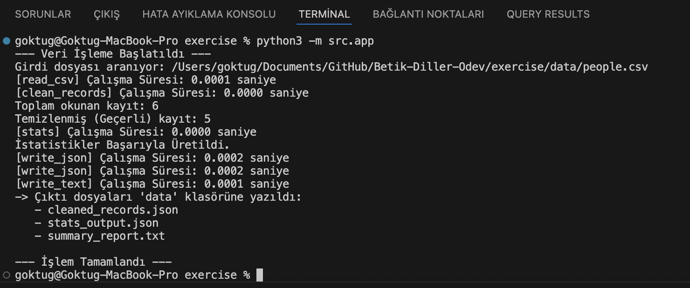
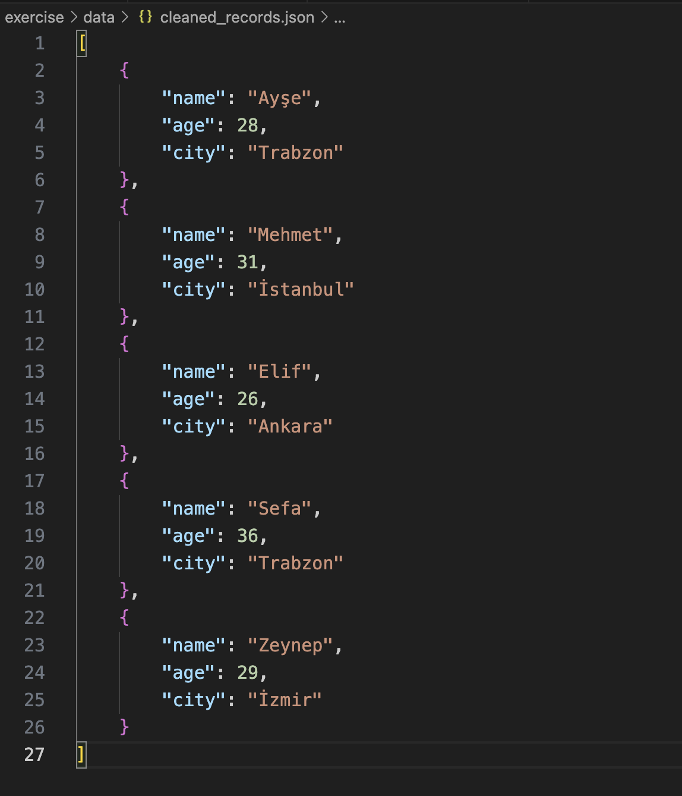
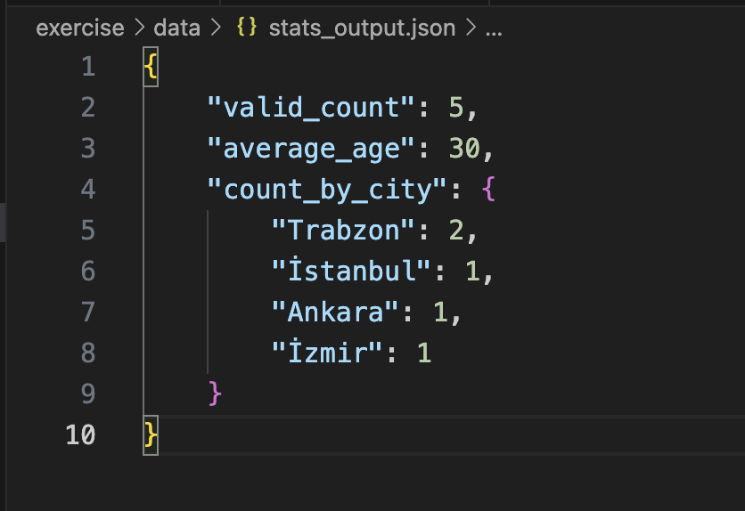

Betik Diller Ödevi - CSV Veri İşleyici

Bu proje, data/people.csv dosyasını okuyan, veriyi temizleyen, zorunlu alanları (name, age, city) bir dekoratör ile kontrol eden ve işlenmiş veriden istatistikler üreten bir Python uygulamasıdır.

Uygulama, Python'ın pathlib, csv, json ve statistics modüllerini kullanır.

Proje Yapısı

Proje, src (kaynak kodu) ve data (girdi/çıktı verileri) olmak üzere iki ana klasörden oluşur.

Nasıl Çalıştırılır?

Projenin kök dizinindeyken (exercise veya betik-diller-odev klasörü) aşağıdaki komutu çalıştırın:

python3 -m src.app

Çıktılar ve Sonuçlar

Script başarıyla çalıştığında, data klasörü içine 3 adet çıktı dosyası üretir.

1. Terminal Çıktısı

Script'in çalışma süresini ve adımlarını gösteren terminal çıktısı:

 
2. Temizlenmiş Kayıtlar (cleaned_records.json)

Geçersiz (boş veya sayısal olmayan yaş) kayıtlar atıldıktan ve veriler temizlendikten sonraki geçerli kayıtların JSON hali:

3. İstatistikler (stats_output.json)

Geçerli kayıtlar üzerinden hesaplanan istatistikler (toplam sayı, ortalama yaş, şehir dağılımı):

4. Özet Rapor (summary_report.txt)

İstatistiklerin okunabilir metin formatındaki raporu:

